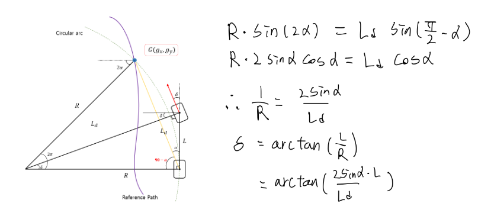
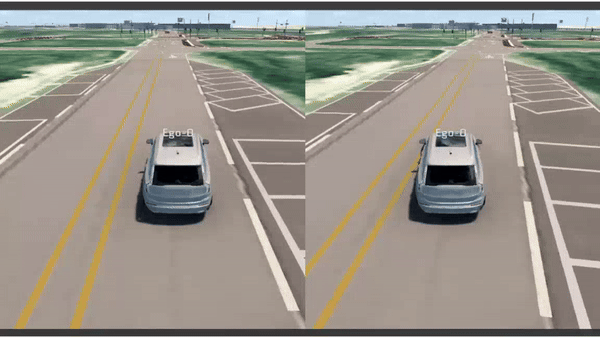
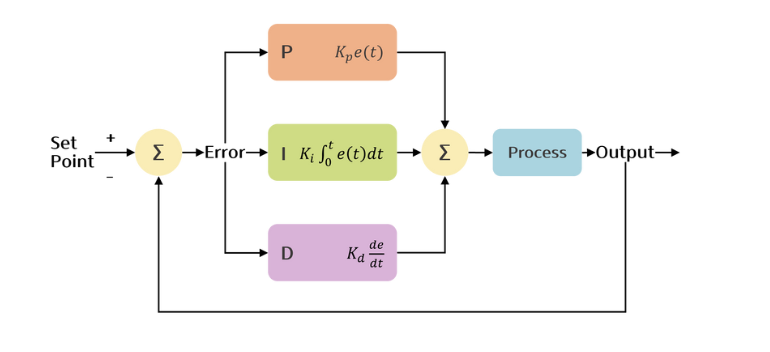
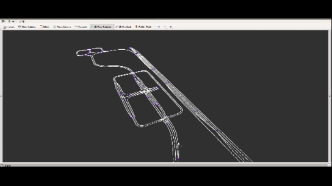
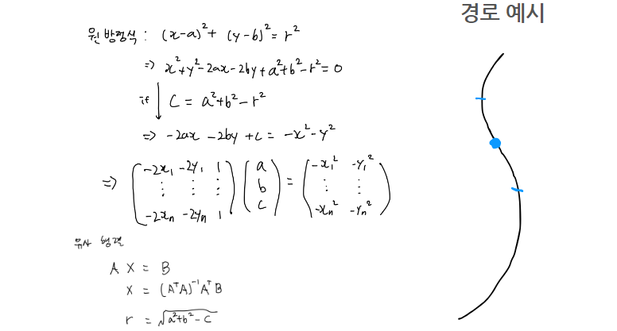
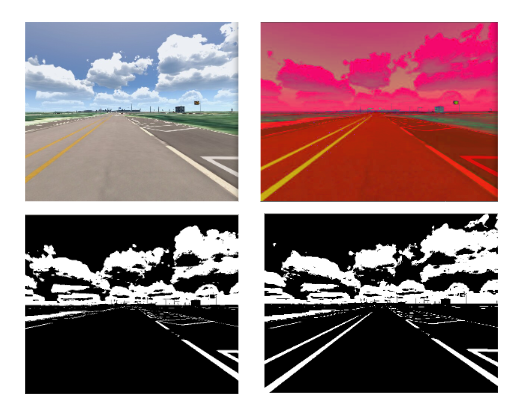
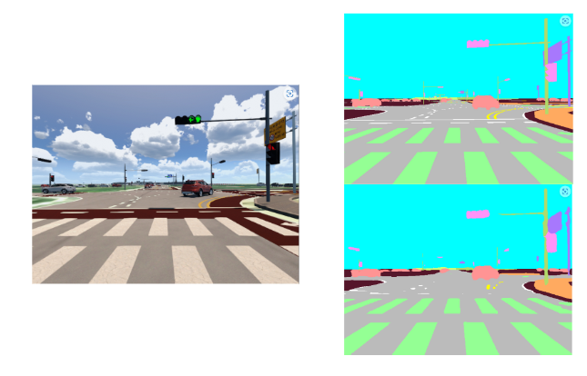
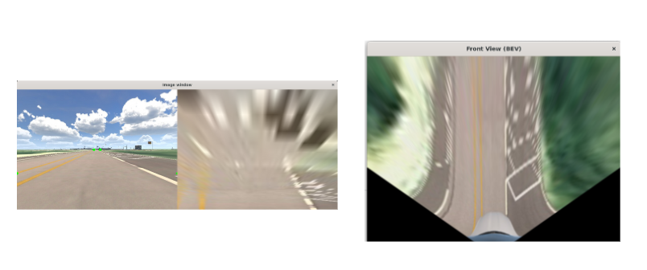
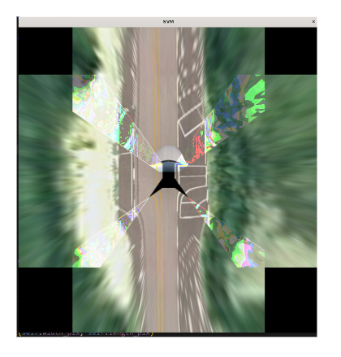

# 🚖MORAI ORAI🚖​
## 📢 프로젝트 소개
---

- 개발 기간 : 2024년 2월 19일 [월] ~ 2024년 4월 4일 [목]
- 주제 : 자율주행
- 개발 인원 : 
[팀명 : MORAI ORAI ]

![팀원소개]

# **🌏 Project**

## 제어

##### 1. Pure Pursuit
경로추종 알고리즘
Ld(전방 주시거리) 제어를 통해 곡률에 맞는 조향각을 얻습니다.

곡률이 클 때는 전방 주시거리가 짧을 때, 직선 구간에서는 전방 주시거리가 길 때 안정적인 주행이 가능합니다.
아래의 그림은 모두 왼쪽은 긴 Ld값, 오른쪽은 짧은 Ld값을 통해 주행한 결과입니다.

###### <곡선구간>

###### <직선구간>

##### 2. PID 제어
PID제어란 피드백 제어의 한 종류로 출력값을 입력값과 비교하여 그 오차를 활용해 제어합니다. 비례, 미분, 적분 제어를 통해 PID 제어를 할 수 있습니다.

##### 5. Dijkstra 알고리즘
최단경로 탐색

##### 4. 경로기반 주행속도
빠른속도로 커브를 돌면 원하는 경로에서 벗어날 확률이 높아집니다.
그래서 따라서 각 경로 노드마다 앞 뒤로 일정 부분을 탐색하여 그 부분의 곡률을 계산해 그 곡률에 적절한 속도를 지정해줍니다.

##### 5. Lattice Planner
충돌 회피
로컬경로 안에 장애물이 인식된다면 현재 경로를 중심으로 하는 6개의 회피경로를 생성합니다. 현재경로에서 멀어질수록 가중치가 높아지고, 장애물이 인식된다면 가중치가 높아집니다. 이렇게 계산된 경로중에서 가중치가 가장 낮은 경로를 선택해 주행하게 됩니다.

 
 ##### 6. Lane Change
차선 변경
왼쪽은 차선변경을 직선으로 / 오른쪽은 3차함수를 사용하여 곡선으로 차선 변경

## 인지

##### 1.  Image parser

##### 2. sementic segmentation
중앙선, 횡단보도, 신호등 정지선 등에 대한 정보를 딥러닝으로 받아 이 정보를 활용해 더 정확한 자율주행이 가능해집니다.

위의 사진은 시뮬레이터에서 제공한 이미지, 아래 사진은 딥러닝 결과입니다.

##### 3. BEV(Bird’s Eye view)
버드아이뷰란 새가 날면서 차 위에서 보듯이 새의시점에서 차를 위에서 아래로 보는 것입니다. 

왼쪽은 명세서의 BEV, 오른쪽은 저희팀이 개선한 BEV입니다. 기존 BEV는 필요한 영역의 사다리꼴을 직사각형으로 선형변환 시켜 원근법이 무시되어 왜곡이 일어납니다. 그래서 저희팀은 원근법을 고려하여 각 지점(픽셀)에 원근법 고려한 원래 화면의 index값을 가르키는 함수를 만들어주어 BEV로 옮겨주었습니다.

저희팀은 BEV를 활용하기위해 서라운드뷰를 세팅하고 자율주차를 구현하려 했습니다.하지만 화면 네개를 사용하는 것은 제공받은 컴퓨터의 CPU로는 처리가 불가능하였습니다.

##### 4. Ridar

라이다는 클러스터링중 하나인 DB scan을 사용하여 객체를 인식하고 
이를 통해 장애물이라고 판단되면 앞에서 보여주었던 출동회피 알고리즘으로 피해주었습니다.

 - 시뮬레이터(Windows): https://develop-morai-s3-bucket.s3.ap-northeast-2.amazonaws.com/Asset/Launcher/Release/MoraiLauncher_Win.zip
 - 시뮬레이터(Linux): https://develop-morai-s3-bucket.s3.ap-northeast-2.amazonaws.com/Asset/Launcher/Release/MoraiLauncher_Lin.zip
